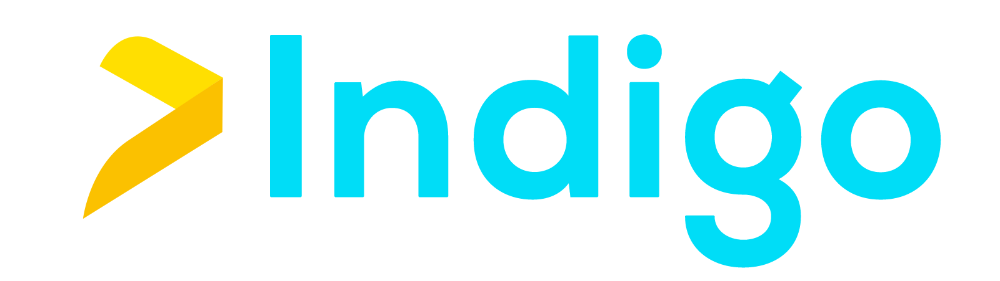

</a>

## What is “INDIGO”?

<b>INDIGO</b> is an application for citizen support and awareness promoted by the young students of the FSJ-7 bootcamp, mainly focused on OBJECTIVE 4 "Create an application that helps people offer their services in the labor market, allowing more people to hire them".

The project itself has been raised with two clear objectives: the first, to involvethe local population and the tourist population in support of small businesses fortheir economic development and contribute to their survival and generate greateremployability. The second of the objectives is to provide entrepreneurs with thosecommunication and advertising tools that are useful and to effectively reach as manycitizens as possible. 

## Requirements:

- Composer 
- Laravel
- Php 
- Mysql
- React
- Html
- Css

## General characteristics of INDIGO 

The INDIGO application responds to the following characteristics: 
Designed especially for those merchants who wish to offer their services in the labor market, but in no case being exclusive for the rest of the population.

- Positive message "there is always more to discover". 

- The target audience of the application is generally made up, although some materials have been designed to reach the microfinance sector. 

- The materials and tools for creation are the following: 

### Technologies implemented 

- Php
- Laravel 
- MySQL

### Technologies to implement 

- Html 
- Css
- JavaScript 
- React

The document with the diagrams can be downloaded and viewed through **[relations diagrams](https://miro.com/app/board/uXjVP5BBITs=/?share_link_id=142775396146)**, being available to facilitate their understanding and adaptation by users.
